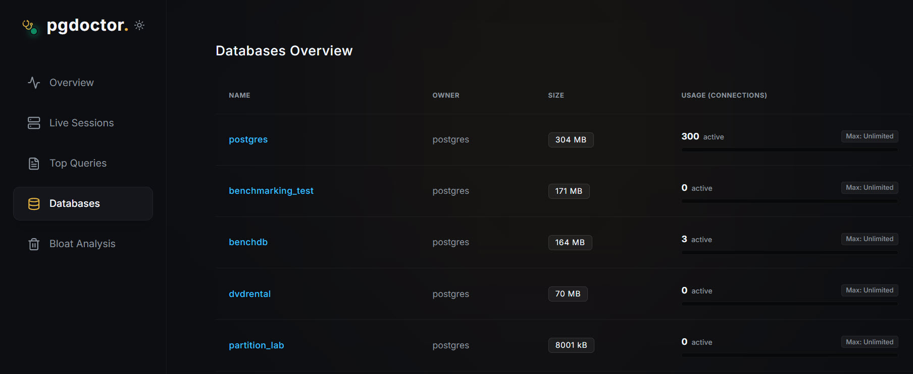
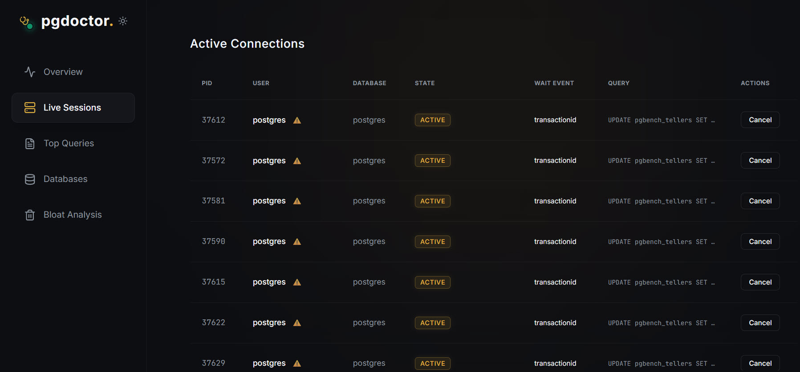
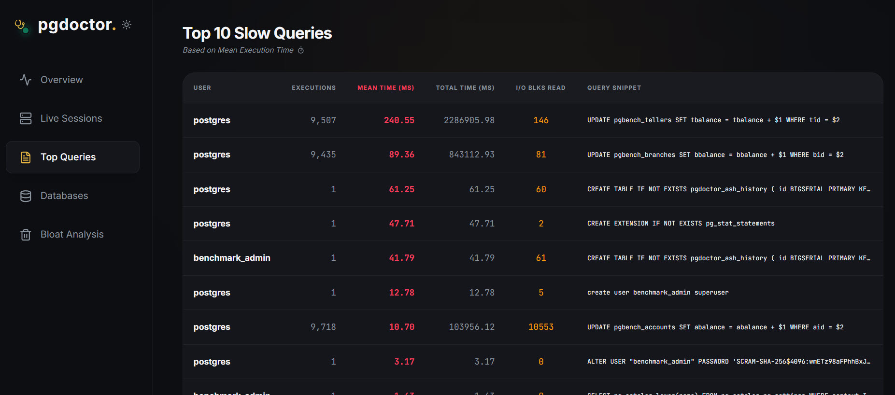

# pgdoctor 🩺

A lightweight and high-performance PostgreSQL monitoring tool built with **Go** and **React**. Track database health, view dead tuples, manage automated tasks, and analyze active session histories (ASH) in real-time.


---

## 🛠️ Key Features & Modules

* **Real-time Dashboard:** Get an instant overview of overall database health, active connections, and CPU/Memory resource utilization.
* **Query Performance Analyzer:** Identify and isolate slow-running queries, track execution counts, and optimize performance using `pg_stat_statements`.
* **Active Session History:** Deep-dive into active and waiting database sessions with comprehensive historical analysis captured natively by the Go background worker.
* **Dead Tuples & Bloat Monitor:** Track dead tuples across tables in real-time to know exactly when your database needs a VACUUM.
* **Background Task Scheduler:** Seamlessly manage historical snapshots and automated metrics collection driven by Go's internal ticker mechanism.

---

## 📋 Prerequisites & Database Setup

### 📋 Requirements
PostgreSQL Version: 13 or higher

### 1. Enable Shared Libraries in `postgresql.conf`
Add `pg_stat_statements` to your shared libraries to allow the database to collect execution statistics:

```ini
shared_preload_libraries = 'pg_stat_statements'
```
*(Note: Changing `shared_preload_libraries` requires a PostgreSQL service restart).*

### 2. Initialize Database Components
Connect to your target database as a superuser and execute the following SQL script to enable the extension and create the required history tracking table:


### 3. Ceate History Table

Run the following SQL script on your monitored database to create the required table and performance index:

```sql
-- Create history table for Active Session Historysnapshots
CREATE TABLE IF NOT EXISTS pgdoctor_ash_history (
    id BIGSERIAL PRIMARY KEY,
    snapshot_time TIMESTAMP WITH TIME ZONE DEFAULT NOW(),
    active_sessions INT NOT NULL,
    idle_sessions INT NOT NULL,
    blocking_locks INT NOT NULL
);

-- Optimize for time-range filtering and descending order queries
CREATE INDEX IF NOT EXISTS idx_pgdoctor_ash_snapshot_time 
ON pgdoctor_ash_history (snapshot_time DESC);
```


## 🚀 Quick Start (Docker Compose)

### Git clone
```bash
git clone https://github.com/rashidov9797/pgdoctor.git
cd pgdoctor 
vi docker-compose.yml
```
### 2. Configuration
Create a `docker-compose.yml` file and paste the following content:

```yaml
version: '3.8'

services:
  pgdoctor-app:
    build: .          # add your build location
    image: pgdoctor:v1
    container_name: pgdoctor-console
    ports:
      - "8080:8080"
    restart: unless-stopped
    environment:
      - PG_HOST=your_postgresql_server_ip
      - PG_PORT=5432
      - PG_DATABASE=your_database_name
      - PG_USER=your_database_user
      - PG_PASSWORD=your_secure_password
      - SERVER_PORT=8080
      - PROTECTED_USERS=postgres 
```

### 3. Run the Container
```bash
docker compose up -d
```


## 📸 Screenshots









### 3. Access the Web UI
👉 Open `http://localhost:8080` or `http://<YOUR_SERVER_IP>:8080`

---

## ⚠️ Warning

This tool is currently under active development. **Do not use it in production environments yet.** Use it at your own risk for development and testing purposes only.
