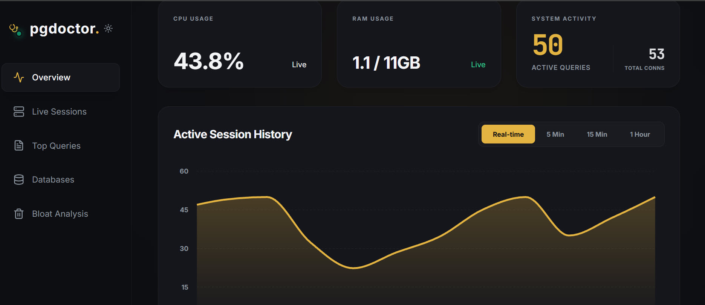

# pgdoctor 🩺

A lightweight and high-performance PostgreSQL monitoring tool built with **Go** and **React**. Track database health, view dead tuples, manage automated tasks, and analyze active session histories (ASH) in real-time.


---

## 🛠️ Key Features & Modules

* **Real-time Dashboard:** Get an instant overview of overall database health, active connections, and CPU/Memory resource utilization.
* **Query Performance Analyzer:** Identify and isolate slow-running queries, track execution counts, and optimize performance using `pg_stat_statements`.
* **Active Session History (ASH):** Deep-dive into active and waiting database sessions with comprehensive historical analysis via `pg_ash`.
* **Dead Tuples & Bloat Monitor:** Track dead tuples across tables in real-time to know exactly when your database needs a `VACUUM`.
* **Cron Job Manager:** Easily monitor and control scheduled PostgreSQL background tasks and automated maintenance scripts driven by `pg_cron`.
* **Buffer Cache Insights:** Analyze memory efficiency and shared buffer usage breakdown across different tables and indexes via `pg_buffercache`.

---

## 📋 Requirements & Database Setup

For `pgdoctor` to function with its full potential, your PostgreSQL instance **must** have the required extensions preloaded.

### 1. Enable Shared Libraries in `postgresql.conf`
```ini
shared_preload_libraries = 'pg_stat_statements, pg_buffercache, pg_cron, pg_ash'
```
*(Note: Changing `shared_preload_libraries` requires a PostgreSQL service restart).*

### 2. Create Extensions in Your Database
```sql
CREATE EXTENSION IF NOT EXISTS pg_stat_statements;
CREATE EXTENSION IF NOT EXISTS pg_buffercache;
CREATE EXTENSION IF NOT EXISTS pg_cron;
CREATE EXTENSION IF NOT EXISTS pg_ash;
```

---

## 📸 Screenshots



---

## 🚀 Quick Start (Docker Compose)

### 1. Configuration
Create a `docker-compose.yml` file and paste the following content:

```yaml
version: '3.8'

services:
  pgdoctor-app:
    image: pgdoctor:v1
    container_name: pgdoctor-console
    ports:
      - "8080:8080"
    restart: unless-stopped
    environment:
      - PG_HOST=your_postgresql_server_ip
      - PG_PORT=5432
      - PG_DATABASE=your_database_name
      - PG_USER=your_database_user
      - PG_PASSWORD=your_secure_password
      - SERVER_PORT=8080
      - PROTECTED_USERS=postgres,dbadmin
```

### 2. Run the Container
```bash
docker compose up -d
```

### 3. Access the Web UI
👉 Open `http://localhost:8080` or `http://<YOUR_SERVER_IP>:8080`

---

## ⚠️ Warning

This tool is currently under active development. **Do not use it in production environments yet.** Use it at your own risk for development and testing purposes only.
